<h1 align="center">👋 𝙃𝙞, 𝙄’𝙢 𝘼𝙣𝙞 𝘼𝙫𝙚𝙩𝙞𝙨𝙮𝙖𝙣</h1>

  𝙄'𝙢 𝙖 𝙅𝙖𝙫𝙖𝙎𝙘𝙧𝙞𝙥𝙩 𝙙𝙚𝙫𝙚𝙡𝙤𝙥𝙚𝙧 𝙥𝙖𝙨𝙨𝙞𝙤𝙣𝙖𝙩𝙚 𝙖𝙗𝙤𝙪𝙩 𝙗𝙪𝙞𝙡𝙙𝙞𝙣𝙜 𝙨𝙘𝙖𝙡𝙖𝙗𝙡𝙚 𝙬𝙚𝙗 𝙖𝙣𝙙 𝙢𝙤𝙗𝙞𝙡𝙚 𝙖𝙥𝙥𝙡𝙞𝙘𝙖𝙩𝙞𝙤𝙣𝙨. 👩🏻‍💻💻

  <picture>
    <source media="(prefers-color-scheme: dark)" srcset="./assets/cards/intro-dark.svg" />
    
  </picture>

  
  &nbsp;
  

  

<h3 align="center">𝙗𝙮 𝙩𝙝𝙚 𝙣𝙪𝙢𝙗𝙚𝙧𝙨 🍑</h3>

  <a href="https://github.com/avetisyan66">
    <picture>
      <source media="(prefers-color-scheme: dark)" srcset="./assets/cards/stats-dark.svg" />
      
    </picture>
  </a>

  <a href="https://github.com/avetisyan66">
    <picture>
      <source media="(prefers-color-scheme: dark)" srcset="./assets/cards/years-dark.svg" />
      
    </picture>
  </a>

Cards are built by <a href="./scripts/generate-cards.mjs">my own script</a> from the GitHub API and refreshed daily ✦ public + private work

---

  𝙂𝙤 𝙘𝙝𝙚𝙘𝙠 𝙢𝙮 𝙥𝙤𝙧𝙩𝙛𝙤𝙡𝙞𝙤 💛 <a href="https://avetisyan66.github.io/">𝙖𝙫𝙚𝙩𝙞𝙨𝙮𝙖𝙣66.𝙜𝙞𝙩𝙝𝙪𝙗.𝙞𝙤</a>
  &nbsp;·&nbsp;
  <a href="https://www.linkedin.com/in/avetisyan66/">𝙇𝙞𝙣𝙠𝙚𝙙𝙄𝙣</a>

